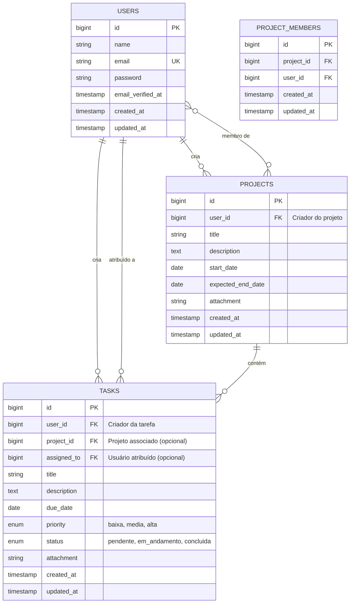

# Instalação

### Requisitos:
xampp (baixar ultima versão para melhor compatibilidade), laragon ou implementação lamp
"php": "^8.2",
"laravel/framework": "^12.0"

### 1. Clonar
git clone https://github.com/wag1j1costa/task-management.git
cd task-management

### 2. Instalar dependências
composer install

### 3. Configurar .env
copy .env.example .env
### EDITAR .env com suas credenciais MySQL!

### 4. Gerar chave
php artisan key:generate

### 5. Executar migrations (criação banco de dados e tables)
php artisan migrate

### 6. Link do storage
php artisan storage:link

### 7. Iniciar servidor
php artisan serve

# Diagrama de Entidades e Relacionamentos (DER)
## Sistema de Gerenciamento de Tarefas

## Descrição das Entidades

### 1. **USERS (Usuários)**
Armazena informações dos usuários do sistema.

**Atributos principais:**
- `id`: Identificador único do usuário
- `name`: Nome completo do usuário
- `email`: E-mail único para login
- `password`: Senha criptografada

**Relacionamentos:**
- Um usuário pode criar **vários projetos** (1:N)
- Um usuário pode criar **várias tarefas** (1:N)
- Um usuário pode ter **várias tarefas atribuídas** a ele (1:N)
- Um usuário pode ser **membro de vários projetos** (N:M através de PROJECT_MEMBERS)

---

### 2. **PROJECTS (Projetos)**
Representa projetos criados pelos usuários para organizar tarefas.

**Atributos principais:**
- `id`: Identificador único do projeto
- `user_id`: Referência ao criador do projeto
- `title`: Título do projeto
- `description`: Descrição detalhada (opcional)
- `start_date`: Data de início do projeto
- `expected_end_date`: Data prevista de conclusão
- `attachment`: Caminho do arquivo anexado (opcional)

**Relacionamentos:**
- Um projeto pertence a **um usuário criador** (N:1)
- Um projeto pode ter **várias tarefas** (1:N)
- Um projeto pode ter **vários membros** (N:M através de PROJECT_MEMBERS)

---

### 3. **TASKS (Tarefas)**
Representa as tarefas individuais que podem estar associadas a projetos.

**Atributos principais:**
- `id`: Identificador único da tarefa
- `user_id`: Referência ao criador da tarefa
- `project_id`: Referência ao projeto (opcional - tarefas podem existir sem projeto)
- `assigned_to`: Referência ao usuário atribuído (opcional)
- `title`: Título da tarefa
- `description`: Descrição detalhada (opcional)
- `due_date`: Data de vencimento
- `priority`: Prioridade (baixa, média, alta)
- `status`: Status atual (pendente, em_andamento, concluída)
- `attachment`: Caminho do arquivo PDF anexado (opcional)

**Relacionamentos:**
- Uma tarefa pertence a **um usuário criador** (N:1)
- Uma tarefa pode pertencer a **um projeto** (N:1 opcional)
- Uma tarefa pode ser atribuída a **um usuário** (N:1 opcional)

**Regras de Negócio:**
- O criador da tarefa pode visualizar, editar e excluir
- O usuário atribuído pode visualizar, editar e marcar como concluída (mesmo que não seja o criador)
- Tarefas podem ser atribuídas ao próprio criador
- Tarefas sem projeto são tarefas pessoais
- Tarefas sem usuário atribuído são gerenciadas apenas pelo criador
- Tarefas atribuídas aparecem nos cards do dashboard do usuário responsável

---

### 4. **PROJECT_MEMBERS (Membros do Projeto)**
Tabela intermediária para relacionamento N:M entre usuários e projetos.

**Atributos principais:**
- `id`: Identificador único
- `project_id`: Referência ao projeto
- `user_id`: Referência ao usuário membro

**Relacionamentos:**
- Liga **projetos** a **usuários** (N:M)
- Permite que múltiplos usuários sejam membros de um projeto
- Permite que um usuário participe de múltiplos projetos

**Regras de Negócio:**
- Apenas o criador do projeto pode adicionar/remover membros
- Membros podem visualizar o projeto e suas tarefas
- Membros podem criar tarefas dentro do projeto

---

## Cardinalidades

| Relacionamento | Cardinalidade | Descrição |
|---------------|---------------|-----------|
| USERS → PROJECTS | 1:N | Um usuário cria vários projetos |
| USERS → TASKS (criador) | 1:N | Um usuário cria várias tarefas |
| USERS → TASKS (atribuído) | 1:N | Um usuário pode ter várias tarefas atribuídas |
| PROJECTS → TASKS | 1:N | Um projeto contém várias tarefas |
| USERS ↔ PROJECTS | N:M | Usuários podem ser membros de vários projetos |

---

## Integridade Referencial

### Chaves Estrangeiras e Ações de Deleção:

1. **PROJECTS.user_id → USERS.id**
   - `ON DELETE CASCADE`: Se o usuário for deletado, seus projetos são deletados

2. **TASKS.user_id → USERS.id**
   - `ON DELETE CASCADE`: Se o usuário criador for deletado, suas tarefas são deletadas

3. **TASKS.project_id → PROJECTS.id**
   - `ON DELETE CASCADE`: Se o projeto for deletado, as tarefas do projeto também são deletadas

4. **TASKS.assigned_to → USERS.id**
   - `ON DELETE SET NULL`: Se o usuário atribuído for deletado, a tarefa volta para o criador

5. **PROJECT_MEMBERS.project_id → PROJECTS.id**
   - `ON DELETE CASCADE`: Se o projeto for deletado, as associações de membros são removidas

6. **PROJECT_MEMBERS.user_id → USERS.id**
   - `ON DELETE CASCADE`: Se o usuário for deletado, suas associações como membro são removidas

---

## Funcionalidades Implementadas

### 🎯 **Sistema de Atribuição de Tarefas**
- Tarefas podem ser atribuídas a qualquer usuário do sistema, incluindo o próprio criador
- Interface com dropdown para seleção do responsável
- Pré-seleção automática do usuário atual ao criar novas tarefas
- Indicação visual de "Você" na lista de usuários

### 📊 **Dashboard Inteligente**
- Cards clicáveis com animações de hover que filtram tarefas por status
- Contadores incluem tarefas criadas + tarefas atribuídas ao usuário
- Seções de tarefas atrasadas e tarefas recentes
- Navegação direta para áreas específicas

### 🎨 **Interface Moderna**
- Ícones Font Awesome em todas as ações (visualizar, editar, excluir, concluir)
- Tooltips informativos em todos os botões
- Animações suaves de hover e transições
- Inputs com padding e bordas visíveis para melhor UX

### 🔄 **Arquitetura Blade Components**
- Migração completa de layouts para sistema de componentes
- `app-layout`: Layout principal para usuários autenticados
- `guest-layout`: Layout para páginas de autenticação
- Estrutura mais limpa e reutilizável

### 📱 **Responsividade e Acessibilidade**
- Design responsivo em todas as páginas
- Tooltips para melhor acessibilidade
- Cores e ícones intuitivos para diferentes ações
- Feedback visual consistente

---
